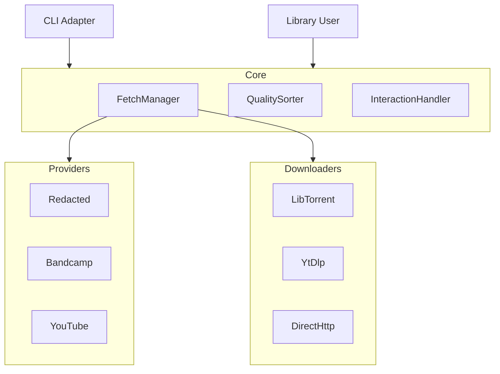

# Architecture & Implementation Plan

## 1. High-Level Architecture

The system will be designed using **Clean Architecture** principles to separate concerns between the core logic, external interfaces (CLI/Library), and infrastructure (APIs/Downloaders).

### Core Components

1.  **Orchestrator (`FetchManager`)**: The main entry point that coordinates searching, selection, and downloading.
2.  **Domain Models**:
    -   `TrackQuery`: Input data (Artist, Title).
    -   `Release`: Represents a finding (Source, Quality, Metadata, Download Link/Magnet).
    -   `Quality`: Value object for audio quality (Format, Bitrate, Source Media) with comparison logic.
3.  **Interfaces (Abstract Base Classes)**:
    -   `Provider`: Interface for searching (e.g., `RedactedProvider`, `YoutubeProvider`).
    -   `Downloader`: Interface for retrieving content (e.g., `TorrentDownloader`, `HttpDownloader`).
    -   `UserInterface`: Interface for interaction (handling selection prompts).

### Component Diagram

## 2. Detailed Design

### 2.1 Provider System
Each provider implements a `search(query: TrackQuery) -> List[Release]` method.
-   **RedactedProvider**: Uses the JSON API (from `Redacted_API_Documentation_Redacted.md`) to search torrents. Maps JSON response to `Release` objects.
-   **PublicProviders**: Wrappers around `yt-dlp` or scraping logic for Bandcamp/Soundcloud.

### 2.2 Quality & Selection Logic
-   **Quality Class**: Implements `__lt__`, `__eq__` to allow sorting.
    -   Hierarchy: `FLAC 24bit` > `FLAC 16bit` > `MP3 320` > `AAC` > `Other`.
-   **Auto-Selection**: `FetchManager` sorts results by `Quality` and picks the top.
-   **Interactive Selection**: `FetchManager` delegates to `InteractionHandler`.
    -   **CLI Implementation**: Prints list to stdout, reads index from stdin.
    -   **Library Implementation**: Accepts a callable/hook passed during initialization or method call.

### 2.3 Downloader System
-   **TorrentDownloader**: Uses `libtorrent`.
    -   *Constraint*: Must masquerade or be compatible with tracker allowlists (specifically checking support for 0.16.3+ features if strictly required, though modern 1.2/2.0 branches are usually standard now).
    -   Manages session, adds magnet/torrent file, monitors progress, alerts on completion.
-   **HttpDownloader**: Standard HTTP GET or `yt-dlp` process.

## 3. Implementation Plan

### Phase 1: Core & Interfaces
-   Define `TrackQuery`, `Release`, `Quality` data classes.
-   Define `Provider` and `Downloader` abstract base classes (ABCs).
-   Implement `Quality` comparison logic.

### Phase 2: Redacted Provider Integration
-   Implement authentication (API Key support).
-   Implement `RedactedProvider.search` using `ajax.php?action=browse`.
-   Parse results into `Release` objects.

### Phase 3: BitTorrent Integration
-   Set up `libtorrent` session management.
-   Implement `TorrentDownloader`.
-   Ensure protocol compatibility.

### Phase 4: Public Providers
-   Implement `YoutubeProvider` using `yt-dlp`.
-   Implement `HttpDownloader`.

### Phase 5: CLI & Library API
-   Build `FetchManager` to tie it all together.
-   Implement `Click` or `Typer` based CLI.
-   Implement `ConsoleInteractionHandler` (CLI) and `CallbackInteractionHandler` (Library).

## 4. Testing Strategy

### 4.1 Unit Testing (`pytest`)
-   **Domain Logic**: Test `Quality` sorting and `FetchManager` flow (mocking providers).
-   **Providers**: Test API response parsing using mocked JSON responses (recorded from actual API calls or synthesized based on docs).
-   **Downloaders**: Mock `libtorrent` session and file system operations.

### 4.2 Integration Testing
-   Test the "Search -> Select -> Download" pipeline with a "MockProvider" and "MockDownloader" to ensure the architecture holds together without hitting real external services.

### 4.3 End-to-End Testing (Manual/Staging)
-   Run against real APIs (limited) to verify contract assumptions.

## 5. Technology Stack
-   **Language**: Python 3.10+
-   **HTTP Client**: `httpx` (async support) or `requests`.
-   **Torrent**: `python-libtorrent` (via system package or pip).
-   **CLI**: `click` or `typer`.
-   **Testing**: `pytest`, `pytest-mock`.
-   **Linter/Formatter**: `ruff`, `black`, `mypy`.

